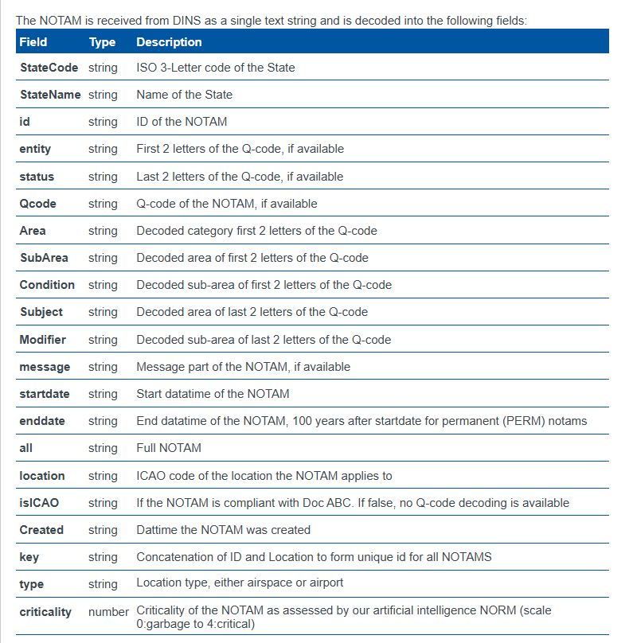

# ✈️ NOTAM Parser

**NOTAM Parser** là một thư viện Python giúp phân tích cú pháp theo định dạng ICAO.

> 📌 NOTAM (Notice to Airmen) là thông báo chứa thông tin quan trọng về hoạt động bay mà không được công bố trước bằng các phương tiện thông thường, thường mô tả tình trạng bất thường của các thành phần trong hệ thống không lưu quốc gia.

---



> Ảnh trên là Data Format trên trang web của ICAO

---
> File q_code.pdf là quy định về mã Q code ở Q line. Trong file quy định chữ cái thứ 2 và 3 của Q code để xác định Q code đó thuộc Area, SubArea nào. Quy định chữ cái thứ 4 và thứ 5 thuộc condition nào và modifier nào
> 

## 🚀 Cài đặt

```bash
pip install parser-notam-package
````

---

## Sử dụng

```python
from parser_notam_package import NOTAMParser

cc = NOTAMParser()

sample1 = """
B1974/25 NOTAMN 
Q) LFBB/QACAH/IV/BO /AE/000/020/4449N00031E009 
A) LFBE B) 2505260000 C) 2506012300 
E) CTR 'BERGERAC' SKED : - MON-FRI : 0600-1800  - SAT : 0700-1010   1130-1700 - SUN : 0645-1000   1120-1645 POSSIBLE 1HR EXTENSION FOR SKED COMMERCIAL FLIGHTS. OUTSIDE THESE SKED, CTR DOWNGRADED TO G AND AD CTL NOT PROVIDED. 
CREATED: 11 May 2025 07:46:00  SOURCE: EUECYIYN
"""

result = cc.parse_notam(sample1)
print(cc.print_result(result))
```

### Kết quả mẫu:

```
State: France
Id: B1974/25
Notam type: NEW
FIR: LFBB
Entity: AC
Status: AH
Category Area: ATM
Sub area: Airspace organization management
Subject: Control zone
Condition: Availability
Modifier: Hours of service are now
...
```

---

## Truy cập từng thành phần riêng lẻ

```python

from parser_notam_package import NOTAMParser

cc = NOTAMParser()
sample1 = """
B1974/25 NOTAMN 
Q) LFBB/QACAH/IV/BO /AE/000/020/4449N00031E009 
A) LFBE B) 2505260000 C) 2506012300 
E) CTR 'BERGERAC' SKED : - MON-FRI : 0600-1800  - SAT : 0700-1010   1130-1700 - SUN : 0645-1000   1120-1645 POSSIBLE 1HR EXTENSION FOR SKED COMMERCIAL FLIGHTS. OUTSIDE THESE SKED, CTR DOWNGRADED TO G AND AD CTL NOT PROVIDED. 
CREATED: 11 May 2025 07:46:00  SOURCE: EUECYIYN
"""

cc.parse_state(sample1)            # 'France'
cc.parse_notam_id(sample1)        # 'B1974/25'
cc.parse_notam_type(sample1)      # 'NEW'
cc.parse_fir(sample1)             # 'LFBB'
cc.parse_notam_code(sample1)      # 'QACAH'
cc.parse_entity(sample1)          # 'AC'
cc.parse_category_area(sample1)   # 'ATM'
cc.parse_sub_category_area(sample1) # 'Airspace organization'
cc.parse_subject(sample1)         # 'Control zone'
cc.parse_status(sample1)          # 'AH'
cc.parse_condition(sample1)       # 'Availability'
cc.parse_modifier(sample1)        # 'Hours of service are now'
cc.parse_area_affected(sample1)   # {'lat': ..., 'long': ..., 'radius': ...}
cc.parse_location(sample1)        # 'LFBE'
cc.parse_dates(sample1)           # (valid_from, valid_till)
cc.parse_schedule(sample1)        # Schedule string
cc.parse_body(sample1)            # Nội dung phần E
cc.parse_limits(sample1)          # (lower_limit, upper_limit)
```

